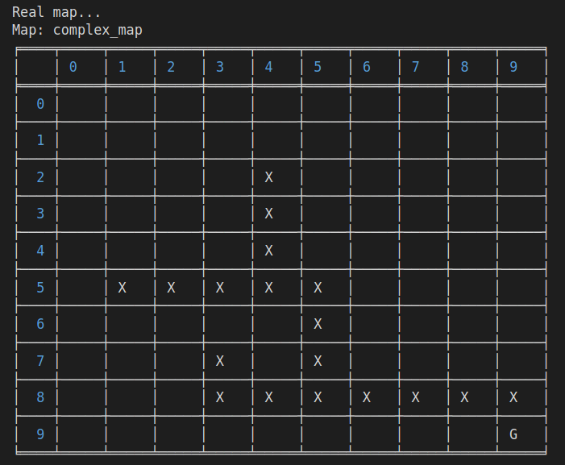
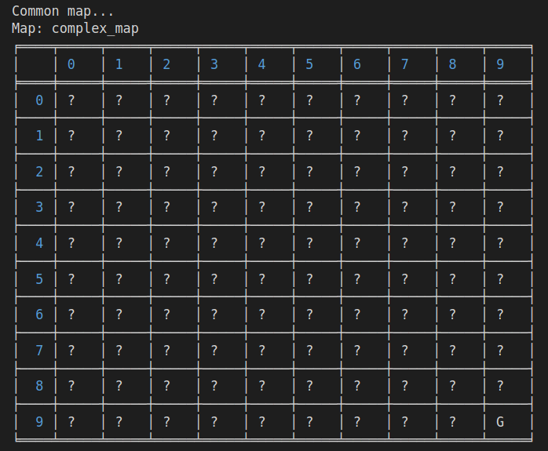
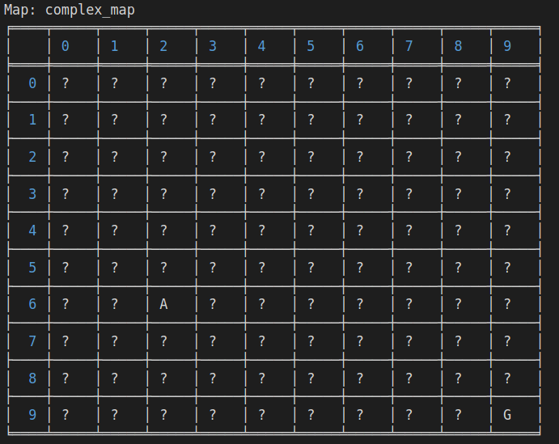
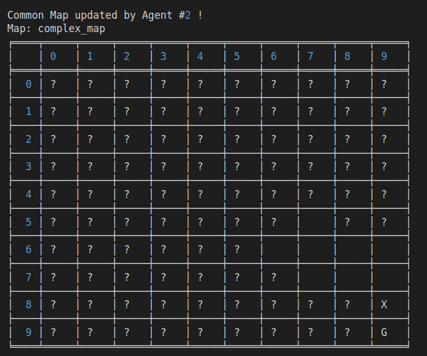
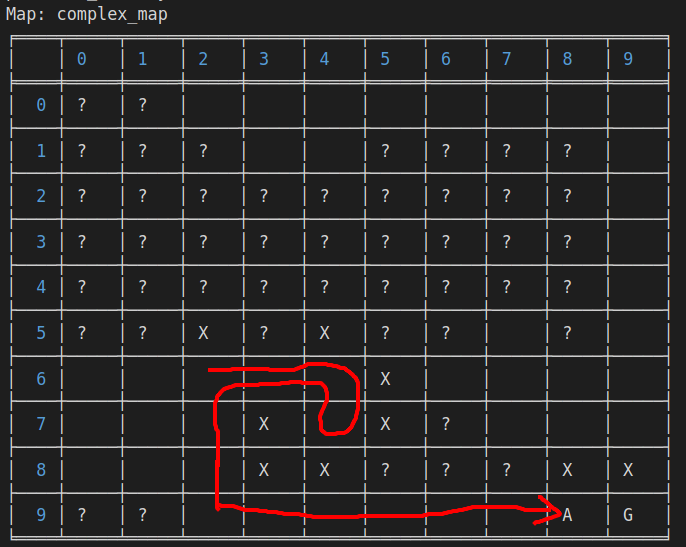
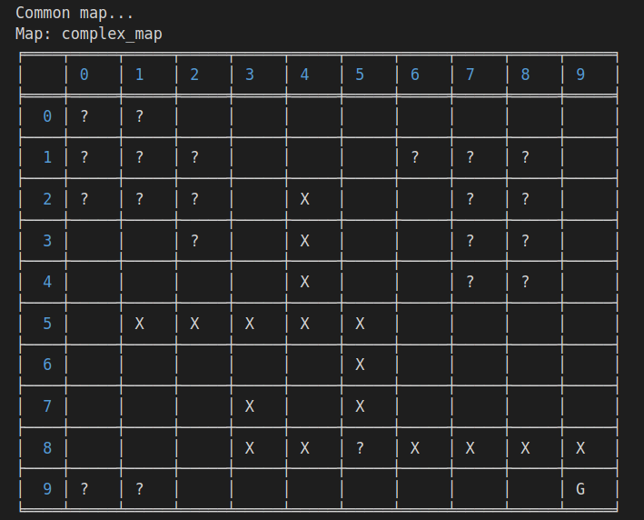

### Table of Contents

- **[Introduction](#introduction)**
- **[Execution example](#execution_example)**
- **[Execution results](#execution_results)**
- **[Bibliography](#bibliography)**

<a name="introduction"></a>

## Introduction

<a name="execution_example"></a>

This project is a simulator for the real life case scenario of multi agent communication.

The world is represented as a 2 dimensional matrix.

The agent goal is to find a valid path to the Goal position.

Different worlds are stored in `./maps` directory.

Agents have a common knowledge, the `common_map` that they will update during their execution if their discovered information is considered valuable.

A\* algorithm is used by the `agents` to predict a possible path through the environment to the Goal position.
The algorithm is enhanced with a `credit` sub-heuristic that rewards the path that contains known positions in the environment.
Due to this small enhancement on the A\* algorithm, the more environment an `agent` knows, the faster it will reach the goal position.

## Execution example

Let's consider the `complex_map` example

### World

World consists of N x N matrices that can contain following values:

```
Map.EMPTY, Map.WALL, Map.GOAL
```



Initially the world is unknown for each agent that tries to reach the goal state
and consists of only unknown values and goal position.

```
Map.UNKNOWN
```

This particular map will be shared and updated by the agents at runtime:



At world initialization the agents will be placed on a random position in an empty cell.

```
Map.AGENT
```

```
Agent name: Agent #0
current_position: (6, 2)
position_history: []
```



At runtime agents (e.g. `Agent #2`) will try to communicate their discoveries
with the others by updating the shared `common_map`



`Agent #0` finishing execution

```
Agent name: Agent #0
current_position: (9, 8)
position_history: [(6, 2), (6, 3), (6, 4), (7, 4), (6, 4), (6, 3),
 (6, 2), (7, 2), (8, 2), (9, 2), (9, 3), (9, 4), (9, 5), (9, 6), (9, 7)]

```



After all agents reach the goal state the `common_map` provides
an overview over agents activity and discoveries:



<a name="execution_results"></a>

## Execution results

Full execution information is stored in the `Search.log` file.

I will present some metrics generated over maps defined in `./maps` directory:

```
{
    "name": "wall_map",
    "total_communications": 47,
    "common_map_updates": 21,
    "communication_delay": 0.1,
    "information_gain_percentage_threshold": 5,
    "number_of_agents": 5,
    "start_time": 1652052024.001205,
    "finish_time": 1652052025.5190723,
    "execution_time": 1.5178673267364502
}
```

```
{
    "name": "x_square_map",
    "total_communications": 29,
    "common_map_updates": 12,
    "communication_delay": 0.1,
    "information_gain_percentage_threshold": 5,
    "number_of_agents": 5,
    "start_time": 1652052025.605216,
    "finish_time": 1652052026.6362934,
    "execution_time": 1.0310773849487305
}
```

```
{
    "name": "complex_map",
    "total_communications": 65,
    "common_map_updates": 18,
    "communication_delay": 0.1,
    "information_gain_percentage_threshold": 5,
    "number_of_agents": 5,
    "start_time": 1652052026.6768532,
    "finish_time": 1652052029.0120258,
    "execution_time": 2.335172653198242
}
```

```
{
    "name": "no_obstacles_map",
    "total_communications": 25,
    "common_map_updates": 10,
    "communication_delay": 0.1,
    "information_gain_percentage_threshold": 5,
    "number_of_agents": 5,
    "start_time": 1652052029.084291,
    "finish_time": 1652052030.7552407,
    "execution_time": 1.6709496974945068
}
```

## Bibliography

<a name="bibliography"></a>

1. Autonomous Robots (2020) 44:43–55 ( https://doi.org/10.1007/s10514-019-09849-0 )
